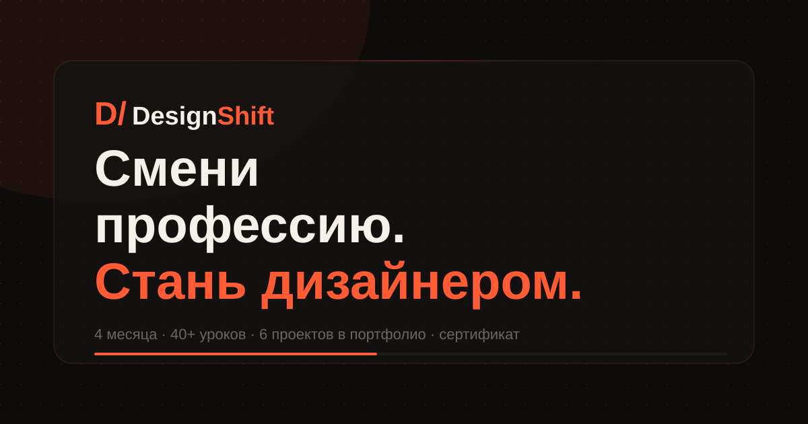

# DesignShift — Landing Page

Landing page for a fictional web design course aimed at career changers. Built as a portfolio project to demonstrate semantic HTML, pure CSS architecture, and vanilla JS.

## Live Demo

[designshift-landing on GitHub Pages](https://georgy-itech.github.io/designshift-landing/)

## Preview



## Features

- Dark / light theme toggle — persisted in localStorage
- Animated CSS marquee (skill tags strip)
- Scroll-reveal animations via IntersectionObserver
- Contact form with inline validation (no alert())
- Form success state swap (form → confirmation panel)
- Responsive layout — works on 375px phones and up
- Fixed header with backdrop blur and scroll state

## Tech Stack

- HTML5 (semantic, accessible)
- Pure CSS (no SCSS, no framework)
- Vanilla JavaScript (no libraries)

## Project Structure

```
designshift-landing/
  index.html
  src/
    css/
      styles.css
    js/
      app.js
  assets/
    icons/
      favicon.svg
    og/
      og-image.svg
  README.md
```

## What I Practiced

- CSS custom properties for full dark/light theme system
- `clamp()` for fluid responsive typography
- CSS `@keyframes` for marquee and entrance animations
- `IntersectionObserver` for scroll-triggered reveals
- Form validation logic without UI libraries
- Accessible markup: aria-labels, aria-live, aria-expanded

## Future Improvements

- Add real backend form submission (e.g. Formspree)
- Add pricing section with toggle (monthly / yearly)
- Add instructor card with real photo
